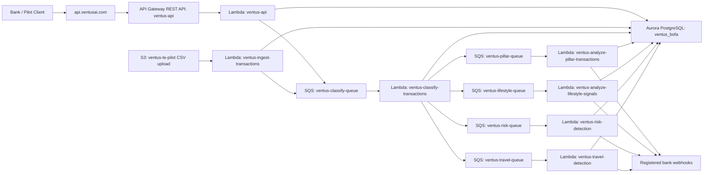

# Ventus AI AWS and Enterprise Readiness Audit

Date: 2026-05-17

This is a working audit of the deployed AWS backend, the GitHub repo, the onboarding document, and the changes needed to support bank pilots and enterprise readiness. AWS inspection was performed through the read-only `monitor` role. No secret values should be committed to this repo.

## Executive Summary

Ventus has a real deployed AWS backend behind `api.ventusai.com`. It is not just the Supabase/Lovable frontend repo. The deployed API supports transaction ingestion, job polling, customer profiles, enriched transactions, trips, life events, risk factors, purchase signals, webhooks, bank analytics, and S3 CSV ingestion.

The main readiness issue is source-of-truth drift. The GitHub repo currently contains the frontend and legacy Supabase/Lovable edge functions, while the live AWS backend code and infrastructure are not represented in the repo or as IaC. This creates risk for enterprise security review, SOC 2 evidence, incident response, reproducibility, and controlled promotion from prototype to production.

## Confirmed Current Architecture

## Confirmed AWS Resources

- Region: `us-east-2`
- API Gateway REST API: `ventus-api`
- API Gateway custom domain: `api.ventusai.com`
- API Gateway stage: `prod`
- Lambda API: `ventus-api`
- Worker Lambdas:
  - `ventus-ingest-transactions`
  - `ventus-classify-transactions`
  - `ventus-analyze-pillar-transactions`
  - `ventus-analyze-lifestyle-signals`
  - `ventus-risk-detection`
  - `ventus-travel-detection`
- Database: Aurora PostgreSQL cluster `ventus-bofa-cluster`, database `ventus_bofa`
- SQS queues plus DLQs:
  - `ventus-classify-queue`
  - `ventus-pillar-queue`
  - `ventus-lifestyle-queue`
  - `ventus-risk-queue`
  - `ventus-travel-queue`
- S3 bucket: `ventus-te-pilot`
- S3 event: `.csv` upload triggers `ventus-ingest-transactions`
- Secrets Manager:
  - RDS/admin credentials
  - combined RDS and Gemini API key secret metadata
- CloudWatch log groups exist for Lambdas and RDS OS metrics.

## Confirmed Live API Surface

The live API routes are implemented in the deployed `ventus-api` Lambda:

- `GET /health`
- `GET /v1/customers/:id/profile`
- `GET /v1/customers/:id/life-events`
- `GET /v1/customers/:id/purchase-signals`
- `GET /v1/customers/:id/trips`
- `GET /v1/customers/:id/risk-factors`
- `GET /v1/customers/:id/transactions`
- `GET /v1/analytics/bank`
- `GET /v1/jobs?s3_key=...`
- `GET /v1/jobs/:id`
- `POST /v1/enrich`
- `POST /v1/webhooks`

Live smoke tests confirmed:

- `GET /health` returns healthy.
- `POST /v1/enrich` accepts a transaction batch and returns `202`.
- `GET /v1/jobs/:id` reports pipeline progress and eventually `complete`.
- `GET /v1/customers/cust_013/transactions` returns enriched demo transactions.
- `GET /v1/customers/cust_013/profile`, `/life-events`, `/trips`, and `/v1/analytics/bank` return demo data.

## Current Pipeline Behavior

`POST /v1/enrich` writes raw transactions to `transactions_raw`, creates `pipeline_runs`, then sends one SQS message per customer to `ventus-classify-queue`.

Classification writes enriched transactions, marks the run `classified`, then publishes to four downstream queues:

- pillar analysis
- lifestyle signal analysis
- risk detection
- travel detection

Each downstream stage increments `pipeline_runs.stages_complete`. Once the counter reaches 4, the status becomes `complete` and `completed_at` is set.

One test batch initially appeared stuck at `travel_detected`, but later completed. Logs showed the pillar worker took around 108 seconds and retried after a malformed Gemini JSON response. This means the status logic works, but job polling may need clearer `processing` semantics and stage-level latency expectations.

## Key Risks and Gaps

### Source of Truth

- The deployed AWS backend code is not present in the GitHub repo inspected.
- No CloudFormation stacks were found in `us-east-2`; no Terraform/CDK was found in the frontend repo.
- Current AWS infra appears likely console/manual unless another private repo exists.
- The repo did not have GitHub Actions workflows before this audit. A minimal CI workflow has been added with build as the blocking check and lint as advisory.

### API Readiness

- `/docs` returns 404.
- `status.ventusai.com` does not resolve.
- API Gateway uses a single proxy route to Lambda, so route contracts are only discoverable from code.
- API Gateway usage plans returned empty. Rate limits may only exist in application code, if at all.
- CORS was originally broad with `Access-Control-Allow-Origin: *`; the recovered `ventus-api` source now uses an environment-driven allowlist through `VENTUS_ALLOWED_ORIGINS`.
- API auth is API-key based and scoped through `bank_id`; this is workable for pilots but should evolve for enterprise admin/user workflows.

### Pipeline Reliability

- Pillar analysis can be slow and can require JSON parse retries.
- Webhook delivery failed for a stale `webhook.site` registration.
- Webhook registrations do not appear to have a client-facing management endpoint for listing, deleting, pausing, or test-delivering webhooks.
- Job completion depends on all 4 downstream stages completing; failures mark a customer failed, but client-facing retry/replay semantics are not yet documented.

### Security and Compliance

- Aurora has encryption and backup retention.
- Cluster deletion protection is enabled, but one DB instance reports deletion protection false.
- One RDS instance is publicly accessible.
- Postgres ingress allows self-reference plus two public `/32` IPs.
- Current RDS exposure is captured as a CI-checked baseline in `infra/security/rds-network-exposure-baseline.json`; target posture is private-only RDS access through approved backend compute and controlled administrative access.
- API Gateway stage tracing and structured access logs were enabled on 2026-05-20. Backend Lambda tracing is now `Active` for the seven recovered backend Lambdas, verified by `npm run --prefix infra audit:tracing`. API access logs write to `/aws/apigateway/ventus-api-prod-access` with 180-day retention.
- CloudWatch log groups mostly lack explicit retention policies.
- No regional WAF ACL was found in `us-east-2`, despite WAF billing.
- S3 public access block and bucket encryption are enabled.
- S3 versioning appears unset.
- Secrets metadata originally indicated a DB credential secret also contained a Gemini API key. On 2026-05-20, a dedicated `ventus/model-providers/gemini` secret was created, all seven backend Lambdas received `RDS_SECRET_ID`, the five model-analysis Lambdas received `MODEL_PROVIDER_SECRET_ID`, model Lambda IAM policies were updated to read the dedicated model-provider secret, the recovered backend package that reads `MODEL_PROVIDER_SECRET_ID` was deployed to the seven backend Lambdas, and `GEMINI_API_KEY` was removed from the DB credential secret. `npm run --prefix infra audit:secrets-cutover` now verifies Lambda configuration and secret content boundaries without printing secret values. Authenticated enrichment smoke passed after deploying model-provider retry resilience. Customer-managed KMS and rotation metadata tags are enabled for both credential secrets. The AWS PostgreSQL single-user rotation Lambda `ventus-db-credential-rotation` was deployed through the protected GitHub infra workflow on 2026-05-21 and is verified by `npm run --prefix infra audit:db-rotation-preflight`; DB rotation schedule enablement and manual model-provider key rotation remain live gaps.

### Billing

May month-to-date AWS cost was about `$63.24` as of 2026-05-17.

Largest drivers:

- EC2-Other: about `$34.92`
- VPC: about `$13.60`
- Amplify: about `$7.82`
- WAF: about `$4.17`
- RDS: about `$0.75`

The EC2-Other/VPC spend appears related to NAT/public IPv4 style networking costs. A NAT gateway named `ventus-tepilot-nat` is present.

## Lovable Promotion Model

Lovable can still be supported, but it should become a prototype source rather than an uncontrolled production deployment path.

Recommended lifecycle:

1. Lovable prototype
2. Pull generated code into GitHub PR
3. Run lint, build, tests, secret scan, API contract checks
4. Deploy to staging from GitHub
5. Promote to production only after review

Production guardrails:

- No direct production deploys from Lovable.
- No secrets or mock data in promoted code.
- Backend contracts must match the OpenAPI spec.
- UI prototypes should call stable API contracts, not ad hoc mock endpoints.
- Staging and production should be separated at AWS account or environment level.

## Recommended Sequence

### Phase 1 - Stabilize and Document

- Keep the `monitor` role as read-only audit access.
- Rotate or delete the temporary long-lived access key used to bootstrap local CLI access.
- Produce a canonical architecture diagram and data-flow diagram.
- Decide where the AWS backend source code should live.
- Add this deployed backend code to GitHub.

### Phase 2 - Pilot Blockers

- Fix `/docs` with an OpenAPI spec and Postman collection.
- Bring `status.ventusai.com` online or remove it from onboarding docs.
- Add clearer job status semantics:
  - `ingested`
  - `classified`
  - `processing_downstream`
  - `complete`
  - `partial_failure`
  - `failed`
- Add stage-level timing to job responses.
- Add webhook management endpoints:
  - list registrations
  - delete registration
  - test delivery
  - retry or inspect delivery failures
- Verify S3 CSV ingestion end to end with a known file and expected output.
- Clean up stale webhook registrations.
- Pay down lint debt enough to make lint a blocking PR check. Local verification on 2026-05-17 showed `npm run build` passes, while `npm run lint` fails on existing code.

### Phase 3 - QA and Evaluation

- Create a golden transaction dataset with expected enriched outputs.
- Add metrics for:
  - merchant normalization accuracy
  - pillar/category accuracy
  - confidence calibration
  - travel detection precision and recall
  - life event precision and evidence quality
  - risk false-positive rate
  - webhook delivery success
  - end-to-end job latency
- Persist human corrections and QA review decisions.
- Version prompts, models, taxonomy, and output schema.
- Add regression tests for every production model/prompt change.

### Phase 4 - Security Hardening

- Add API rate limits or usage plans.
- Confirm final production `VENTUS_ALLOWED_ORIGINS` values for approved bank, Ventus, staging, and prototype domains before deployment.
- Enable API Gateway or Lambda tracing.
- Add CloudWatch alarms for:
  - Lambda errors
  - Lambda duration
  - SQS DLQ depth
  - job failure rate
  - stuck jobs
  - webhook failure rate
- Add explicit log retention.
- Review and reduce public RDS exposure by validating/removing the two public `/32` Postgres exceptions and moving the public RDS instance to private-only access.
- Separate DB credentials from model-provider secrets.
- Add secret rotation strategy.
- Enable S3 versioning if the bucket stores bank uploads.
- Locate WAF spend and either attach WAF intentionally or remove unused WAF resources.

### Phase 5 - IaC and CI/CD

- Import current AWS resources into Terraform or AWS CDK.
- Start with read-only import and plan review, not live replacement.
- Codify:
  - API Gateway
  - custom domain and certificate
  - Lambdas
  - SQS queues and DLQs
  - S3 bucket and notification
  - Aurora cluster
  - IAM roles
  - CloudWatch log retention and alarms
  - VPC/security groups
  - secrets references
- Add CI checks for build, tests, secret scanning, and IaC plan.
- Add staging and production promotion rules.

### Phase 6 - Compliance Readiness

- Draft SOC 2 readiness matrix and owner list.
- Build evidence collection for:
  - access control
  - change management
  - vulnerability management
  - incident response
  - backup and recovery
  - logging and monitoring
  - vendor/subprocessor management
  - data retention and deletion
- Draft PCI scope memo. Recommended posture: avoid receiving cardholder data such as PAN/CVV and rely on tokenized transaction IDs.
- Prepare a bank-facing security and AI governance packet.

## Ownership Split

Codex can handle:

- AWS read-only audits
- deployed-code inspection
- architecture and readiness docs
- OpenAPI and Postman drafting
- GitHub repo organization
- CI/test scaffolding
- IaC drafting/import planning
- QA framework design and implementation
- security-hardening PRs once source/infra write access exists

Ventus team must own or approve:

- access key rotation/deletion
- production AWS changes
- bank-facing commitments
- legal/compliance signoff
- final taxonomy and model-risk decisions
- partner sandbox credentials for FIS, Fiserv, Jack Henry, Salesforce, or bank pilots
- production incident-response ownership
